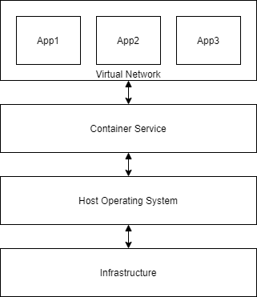

# Ed-Fi in Containers

## Introduction

A number of engaged members of the Ed-Fi Community have asked about support for
running the Ed-Fi ODS/API in Docker, the most popular container technology. An
initial foray was made in 2018, providing critical learning opportunities.
However, until recently there were significant architectural challenges to
having a robust containerized solution. Recent and work-in-progress (as of June,
2020) developments will soon unlock full-fledged container support. What should
that support look like?

## Background on Containers

### What is a Container?

Docker describes a container as a "standardized unit of software." Each unit is:

- **Independent**: design applications with loose coupling so that they can be
  started and stopped independently.
- **Isolated/secure**: container technology and host operating system keep the
  application processes from interacting with each other except through standard
  network protocols, as depicted in the diagram to the right. Small: good
  containers are purpose-built to be small and lean, requiring minimal hardware
  resources.
- **Remixable**: deploy multiple instances of the same container and/or use in
  novel combinations.

For example, an application stack composed from containers might include

- A web application, which connects to
- A custom API, along with
- Its backend data store, and
- An off-the-shelf log parsing application, which pulls the API logs and pushes
  them into
- An off the shelf document store, which is viewable through
- An off the shelf log visualization web application.

### Why Containers?

Those six samples above could have all run directly in the operating system.
"Unitization" of software encourages implementation of sound application design
patterns, but there is an operational cost: greater complexity means more effort
to deploy and manage these separate components.

The Container Service shown above, however, removes much of the burden of the
management and deployment. The various container services simplify operations by
enabling rapid application deployment and startup, horizontal scalability, and a
powerful distribution model. These services provide out-of-the-box security
features and allow the developer to build securely from the ground-up through
infrastructure-as-code and by creating a production-like environment right on
the workstation. Finally, container services built on Docker and Kubernetes
technology are supported by every large cloud provider and on-premises, making
it relatively straight-forward to move workloads from one provider to another
without vendor lock-in.

### Key Technologies and Terms

- **Docker**: the most popular container technology; available on Linux, MacOSX,
  and Windows.
- **Image**: pre-built template for a container.
- **Container**: running instance.
- **Compose**: single-host (simpler) orchestration.
- **Kubernetes**: most popular container orchestration platform
  - Automation
  - Elastic Scaling
  - Available on all major cloud providers

### Implementation Concerns

- **Host platform**: Windows or Linux? Windows containers are nice-to-have, but
  Linux containers are the gold standard.
- **Layering**: being very careful about how Docker images are built to avoid
  image bloat
- **Microservices**: prefer to split large monoliths into multiple small and
  independent applications, to achieve the aims of small, isolated, and
  elastically scalable containers.
- **Networking**: expose only necessary ports, leaving other networking ports
  firewalled from outside the network.
- **Service Discovery**: use name resolution inside the Docker network to find
  related services, minimizing the need to setup one service’s configuration for
  accessing other services.
- **Logging**: Docker tools query standard out and standard error console logs,
  so prefer console to file logging.
- **Storage**: containers are impermanent, so writeable files should be stored
  in external volumes.

These concerns should be addressed by a clear, written Ed-Fi standard for Docker
development.

## Ed-Fi on Docker - Present

As mentioned, a solution on Docker was built in 2018. Funded by the Dell
Foundation, it was shared with the community on the [Ed-Fi
Exchange](https://docs.ed-fi.org/reference/docker/v2/).
With this solution, any Licensee could run ODS/API 2.3.1, 2.4.0, or 2.5.0.1 in
Docker on Windows in Sandbox mode. Because of licensing concerns, the Docker
images were not pushed to the [Docker Hub](https://hub.docker.com/); individual
users had to build and manage the images on their own, although they would
deploy the official released binary packages. At least the user didn't have to
recompile the application source code first. The solution worked and provided a
viable means for quickly switching between and testing out these three versions.

There were some problems though, which kept the solution from being more widely
useful:

- Because Active Directory does not work inside of containers, the Security
  Configuration Tool, Admin App, and Server Side Bulk Load services could not be
  run inside the container. Thus the deployment either had to be in Sandbox Mode
  (not appropriate for production) or client keys and secrets would have to be
  managed manually with database commands, which is rather tedious.
- Application logs were sent to files instead of the console.
- A change in the database deployment process for Tech Suite 3 caused failures
  while trying to deploy the database into SQL Server running in a container.
- There was no attempt to define microservices.
- All services running on IIS in Windows, due to the requirement for .NET
  Framework.

The diagram below shows the design layout of the four containers in this
solution: Web API, ODS Swagger, Sandbox Admin, and SQL Server databases.
Security certificates and database files are correctly stored on the host
filesystem.

## Ed-Fi on Docker - Future

### Key Developments

- Support for PostgreSQL: Gives us a license-free, enterprise database platform
  that runs more stably in Docker than SQL Server does.
- New Database Deployment Process: A new process was created for ODS/API 3.3 to
  support both SQL Server and PostgreSQL, which should fix the deployment
  challenges in versions 3.0-3.2.
- Admin App without Active Directory: Admin App now has its own user management
  process that does not rely on Windows Active Directory to authenticate the
  user, thus removing the key barrier to running it in a container.
- Bulk Load: Server-side bulk load process has been removed, and the API client
  loader has been improved. This will help minimize the image size for the API
  stack and opens the door to creation of an image for the client bulk loader
  utility.
- Apache License: Because the ODS/API code is now under an open source license,
  it will be feasible to push images to the Docker Hub with no licensing
  concerns.
- Plugin Extension Support: The API is being refactored so that extensions can
  be un/loaded dynamically as plugins, instead of having to recompile the
  codebase for every new/removed extension. This opens up the possibility
  composing extension layers on top of the based API image.
- .NET Core: The code for ODS/API and Admin App is being converted to .NET Core
   3.1, allowing the applications to run in Linux-based containers. For more
   information, see Conversion to .NET Core 3.1

### Working Vision for Future State

What should the future state platform look like? There will likely be multiple
answers depending on the implementation needs. As a starting point for further
discussion, we make the following proposals.

#### Possible Production Configuration

#### Possible Sandbox Configuration

### Platform and Orchestration

- Linux-based containers, though open to considering Windows containers if there
  is real demand.
- Docker-compose for initial local development, moving to Kubernetes for
  full-scale orchestration.
- Out-of-the box support for starting up "sandbox" and "production" environments
- Sandbox containing: API, ODS Swagger, Sandbox Admin Web
- Production containing: API, Admin App.
- Careful use of volumes for persistent storage.

### .NET Applications

- .NET Core web services running with the Kestrel web server, without IIS.
  - Setup logging to console.
- Introduce an API Gateway layer as a single-point of entry for all HTTPS
  services.
  - Terminate TLS encryption
  - Loading balancing
  - Setup logging to console.
- Six containers:
  - API Gateway
  - API
  - Sandbox Admin Web
  - ODS Swagger
  - Admin App
  - Client-side Bulk Loader (for on-demand use)
- Investigate feasibility / desirability of moving authentication resources out
  of the main API application into a separate service.
- Investigate options for in-memory shared-cache (e.g. Redis).

>**Note** The .NET-based Ed-Fi Data Import tool is not listed here at this time
> for two primary reasons:
>
> 1. Longer time frame to get to .NET Core.
> 2. Not yet converted for PostgreSQL storage of its internal database(s).

### Database

- PostgreSQL, with SQL Server added if there is demand.
- Two containers: Admin/Security, and the ODS.
- Consider empty, minimal, populated, and Glendale and/or Northridge data sets
  as separate containers.

## Concerns and Questions

- Update cadence - images may need to be updated more frequently than the Ed-Fi
  application releases, due to OS-level and framework tool security patches
- Is there any call for using Windows containers in addition to (but not instead
  of) Linux containers?
- Do we need to build in more fault tolerance / circuit breakers to handle the
  more ephemeral nature of container uptime?
- Should the standard architecture include an external caching service that can
  be shared across API container instances?
- Should the standard architecture include tools for aggregating and visualizing
  log data, including custom applications, HTTP, and database?
- Provide “guidance” on when and how to mix and match containers with managed
  services for optimizing cost and management when deploying to a cloud
  provider.

## Next Steps - Initial List

Sketch of the tasks needed to move us toward a full and robust Docker-based
Ed-Fi ODS/API solution:

- Identify willing beta testers.
- Develop initial standards document.
- Evaluate concerns and questions, and gather feedback on the proposed solution.
- Choose API Gateway (NGiNX, lighttpd, Node-based)
- Build each identified image.
- Create Docker Compose files for localhost orchestration
- Create Kubernetes files for distributed orchestration

## Feedback

The Ed-Fi Alliance gathered feedback on the above notes through a Special
Interest Group that convened in July, 2020. Some key observations and
recommendations from that meeting:

- Yes, start with Compose and then look to Kubernetes with Helm support.
- Consider how to setup for blue-green deployment success.
- Make a list of use cases and prioritize them to define an MVP.
- Start with Linux, consider Windows down the road based on demand.
- Leave fault tolerance to the orchestration engines and other products.
- External caching will be needed for large implementations (e.g. state), but
  there is a considerable cost to refactoring the the ODS / API.
- No need for Ed-Fi to configure logging tools - just log to the console as
  planned.
- Admin App is helpful but not required.

### Identified Use Cases

1. Local development.
1. LEA with a single "shared instance" ODS database.
1. LEA with year-specific ODS databases.
1. Multi-tenant service center.
1. Multi-tenant SaaS provider.
1. SEA with a single shared ODS database.
1. SEA year-specific ODS databases.
1. Extension support matrixed on to the cases above.

### MVP 1: Docker Compose for Development

Planned features:

- .NET Core on Linux
- PostgreSQL
- Docker Compose orchestration
- Containers:
  - ODS with populated template
  - Admin / Security databases
  - Web API
  - Sandbox Admin
  - Swagger UI
  - API gateway / reverse proxy
